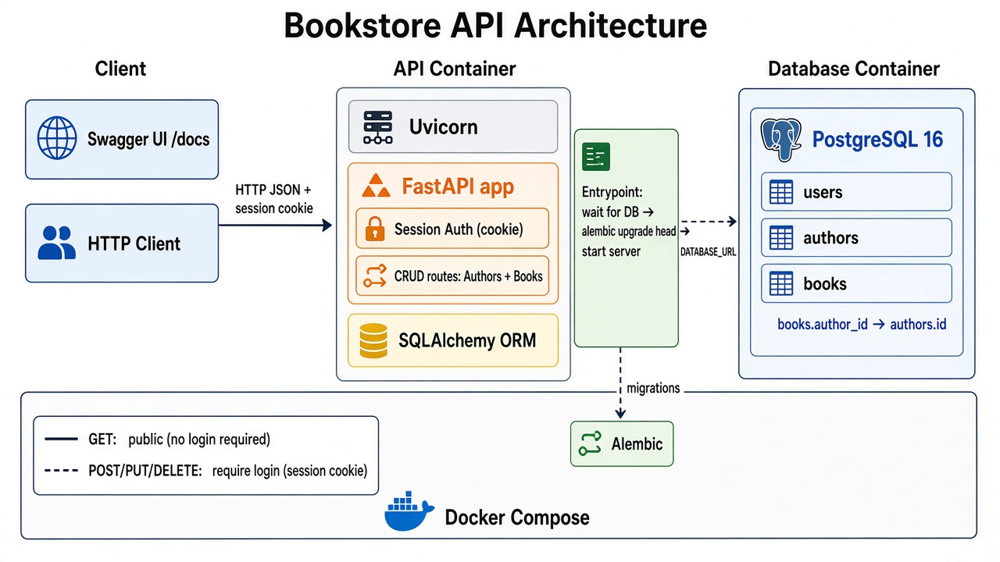
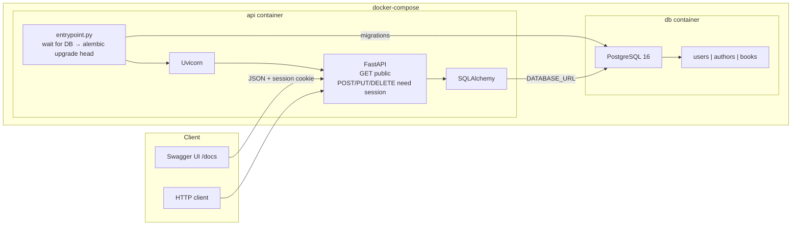

# Bookstore API

FastAPI + PostgreSQL + Alembic + Docker. Authors and books with cookie session auth on write endpoints.

## Architecture





**Request flow:** browser hits `/docs` → FastAPI → SQLAlchemy → Postgres. On container start, `entrypoint.py` waits until Postgres accepts connections, runs `alembic upgrade head`, then starts Uvicorn. Tables are never created with `Base.metadata.create_all()`.

## Project layout

```
bookstore/
├── app/
│   ├── __init__.py
│   ├── main.py          # routes
│   ├── models.py        # SQLAlchemy tables
│   ├── schemas.py       # Pydantic request/response bodies
│   ├── auth.py          # password hash + login dependency
│   └── database.py      # engine from DATABASE_URL
├── alembic/
│   ├── env.py
│   └── versions/        # 001_initial.py
├── alembic.ini
├── Dockerfile
├── docker-compose.yml
├── render.yaml          # Render web + Postgres
├── entrypoint.py        # migrate then serve
├── requirements.txt
├── .env
└── architecture.png
```

## Deploy on Render (no local Docker)

Render builds the `Dockerfile` and gives you a hosted Postgres. It does **not** run `docker-compose.yml` — that file stays in the repo for the class requirement.

You need a **GitHub** account. Render deploys from a git repo.

### 1. Put the project on GitHub

Create a new empty repo on GitHub (no README), then from this folder:

```bash
git init
git add .
git commit -m "Bookstore API"
git branch -M main
git remote add origin https://github.com/YOUR_USERNAME/bookstore.git
git push -u origin main
```

### 2. Create the services on Render

**Option A — Blueprint (easiest)**

1. Go to [https://dashboard.render.com](https://dashboard.render.com) and sign up with GitHub.
2. **New** → **Blueprint**.
3. Select the `bookstore` repo. Render reads `render.yaml`.
4. Apply. That creates `bookstore-api` (web) and `bookstore-db` (Postgres).
5. Wait for the first deploy (a few minutes). Free Postgres can take a bit to come up; the container waits, then runs `alembic upgrade head`.

**Option B — click by click**

1. **New** → **PostgreSQL** → name `bookstore-db` → instance type **Free** → Create.
2. **New** → **Web Service** → connect the same GitHub repo.
3. Runtime: **Docker**. Instance type: **Free**.
4. Environment variables:
   - `DATABASE_URL` = the database **Internal** connection string (from the Postgres page)
   - `SECRET_KEY` = any long random string
5. Create Web Service.

### 3. Open Swagger

When the deploy is Live, open:

`https://bookstore-api.onrender.com/docs`

(Your URL will look like `https://bookstore-api-xxxx.onrender.com/docs`.)

Free web services **sleep after ~15 minutes** idle. The first request after sleep can take a minute. Free Postgres **expires after 30 days**.

## Test in Swagger UI

GET routes are public. Writes need a session cookie.

1. **POST /register** — `{ "username": "ada", "password": "secret1" }`
2. **POST /login** — same body. The response sets `bookstore_session`.
3. **POST /authors** — `{ "name": "Chinua Achebe", "bio": "Nigerian novelist" }`
4. **POST /books** — `{ "title": "Things Fall Apart", "author_id": 1 }`
5. **GET /authors** and **GET /books** — no login needed
6. **PUT /books/1** then **DELETE /books/1** — still logged in
7. **POST /logout** then try **POST /authors** — should be `401`

You cannot delete an author who still has books (409). Delete the books first.

## Local run without Docker

Postgres must already be running. Point `DATABASE_URL` at `localhost` in `.env`, then:

```bash
python -m venv .venv
.venv\Scripts\activate
pip install -r requirements.txt
alembic upgrade head
uvicorn app.main:app --reload
```

## Environment

| Variable | Purpose |
|---|---|
| `DATABASE_URL` | SQLAlchemy connection string |
| `SECRET_KEY` | Signs the session cookie |
| `PORT` | Set by Render (default `10000`). Local Docker uses `8000`. |

On Render, use the **Internal** database URL. Inside Compose the hostname is `db`.

## Run with Docker locally (optional)

```bash
docker compose up --build
```

Open [http://localhost:8000/docs](http://localhost:8000/docs).
